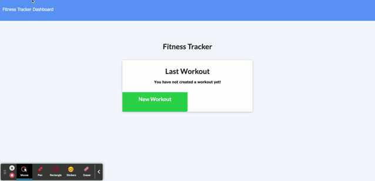

# Fitness_Tracker

## Table of Contents

1. [Application Links](##Application-Links)
2. [Webpage Details](##Webpage-Details)
3. [Demo Video](##Demo-Video)
4. [Requirements](##Requirements)

## Application Links

Deployed Link: https://peaceful-ocean-83388.herokuapp.com/stats

Github Repo Link: https://github.com/JuliaKiser/Fitness_Tracker

## Webpage Details

This fitness tracker is a simple web application designed to have users log specific cardo/resistance work outs and keep a log overtime. Its simple drop down features and ready made input fields, all the user has to do is key it in, click add workout to keep adding or complete to stop then visit their dashboard for a full overview.

## Demo Video

## Requirements

When the user loads the page, they should be given the option to create a new workout or continue with their last workout.

The user should be able to:

- Add exercises to the most recent workout plan.

- Add new exercises to a new workout plan.

- View the combined weight of multiple exercises from the past seven workouts on the `stats` page.

- View the total duration of each workout from the past seven workouts on the `stats` page.

---

---

[Back to Top](##Table-of-Contents)
